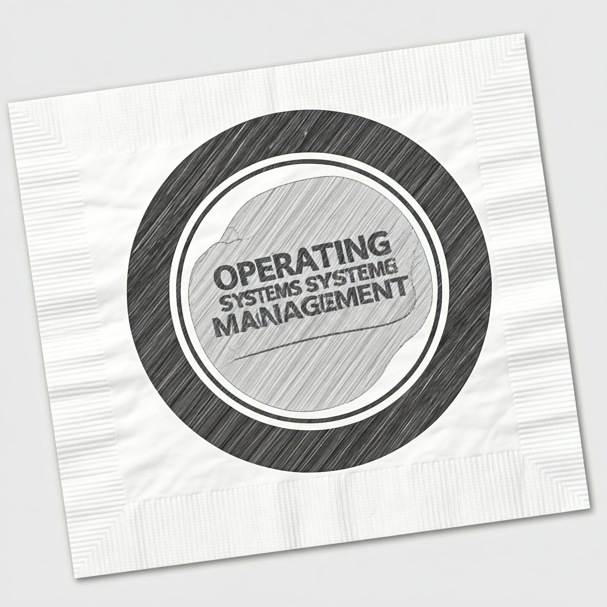
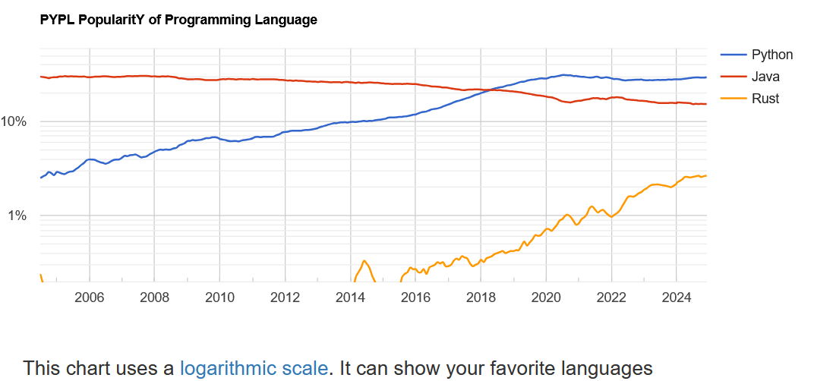
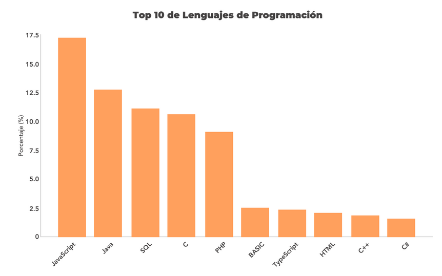
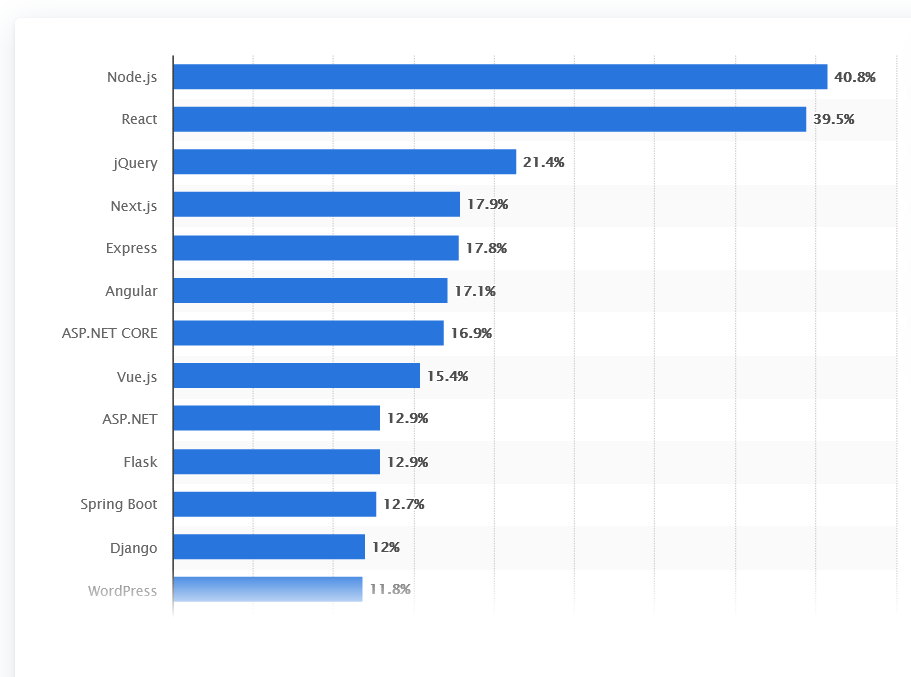
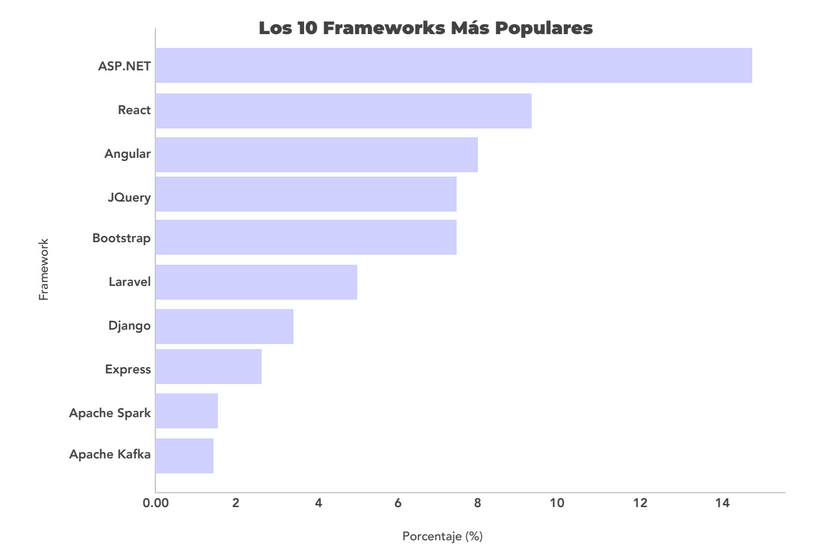
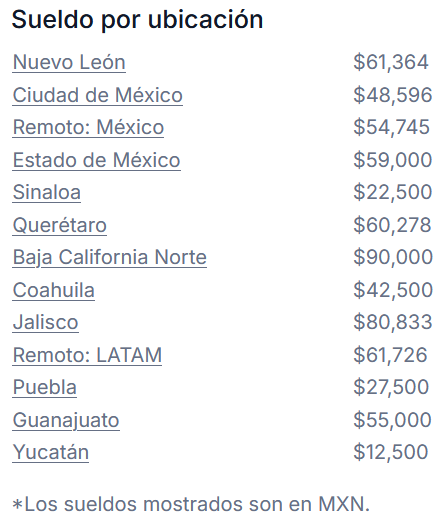
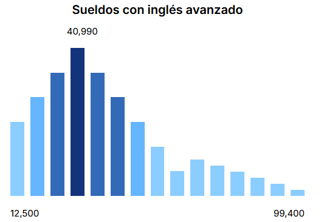
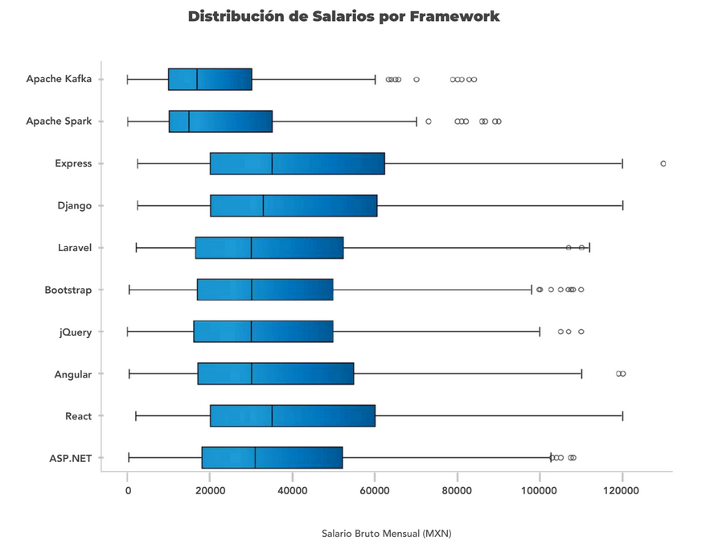

# Aplicaciones web con Python

## Un mapa general del ecosistema de Python

### 2005 - Instituto Tecnológico de Mexicali

---

# Introducción a Python

> Python es un lenguaje de programación ***interpretado*** de alto nivel que fue desarrollado por [Guido Van Rossum](https://es.wikipedia.org/wiki/Guido_van_Rossum) a finales de los 80 y principios de los 90.

---

# Breve historia de Python

- **1980's** : Bases del lenguaje: Lenguaje ABC: ***Guido Van Rossum***
- **1991**: Python 0.9
- **2000**: Python 2.0
- **2008**: Python 3.0
- **2020**: Python 3.9 y fin de vida de Python 2.7
- **2025**: Python 3.14

---

# Usos principales de Python

---

# Modelado y análisis de datos en **Big Data** y **Ciencia de datos**

- [NumPY](https://numpy.org/)
- [Pandas](https://pandas.pydata.org/)
- [SciPy](https://scipy.org/)
- [Matplotlib](https://matplotlib.org/).

---

# Inteligencia Artificial y Aprendizaje Automatico

- [SciKit-learn](https://scikit-learn.org/stable/)
- [Tensorflow](https://www.tensorflow.org/)
- [PyTorch](https://pytorch.org/)
- [Keras](https://keras.io/).

---

# Desarrollo web

- [Django](https://www.djangoproject.com/)
- [Flask](https://flask.palletsprojects.com/en/stable/)
- [FastAPI](https://fastapi.tiangolo.com/)
- [Tornado](https://www.tornadoweb.org/en/stable/)
- [Pyramid](https://trypyramid.com/)
- [Turbogears](https://www.turbogears.org/)
- [CherryPy](https://cherrypy.dev/)
- [Bottle](https://bottlepy.org/docs/dev/)

---

# Bases de datos

- SQL
  - [Sqlite](https://docs.python.org/es/3.13/library/sqlite3.html), [PostgreSQL](https://www.psycopg.org/), [SnowFlake](https://docs.snowflake.com/en/developer-guide/python-connector/python-connector), [MySQL](https://dev.mysql.com/doc/connector-python/en/), [Oracle](https://python-oracledb.readthedocs.io/), [MSSQL](https://learn.microsoft.com/es-es/sql/connect/python/python-driver-for-sql-server?view=sql-server-ver16)
- ORMs
  - [Django](https://docs.djangoproject.com/en/5.1/topics/db/queries/), [SqlAlchemy](https://www.sqlalchemy.org/), [PeeWee](http://docs.peewee-orm.com/en/latest/), [PonyORM](https://ponyorm.org/)
- NoSQL
  - [Redis](https://redis.io/docs/latest/develop/clients/redis-py/), [MongoDB](https://www.mongodb.com/resources/languages/python), [Apache Cassandra](https://docs.datastax.com/en/developer/python-driver/3.29/index.html), [Neo4j](https://neo4j.com/docs/python-manual/current/), [Firebase/Firestore](https://firebase.google.com/docs/firestore/quickstart?hl=es#python)
- Message Brokers
  - [RabbitMQ](https://www.rabbitmq.com/), [Kafka](https://kafka-python.readthedocs.io/en/master/), [ZeroMQ](https://zeromq.org/languages/python/), [AWS MQ](https://boto3.amazonaws.com/v1/documentation/api/1.35.8/reference/services/mq.html)

---

# Cómputo en la nube

- AWS -> [Boto](https://aws.amazon.com/es/sdk-for-python/)
- [Azure](https://azure.microsoft.com/es-mx/resources/developers/python)
- [Google (GCP)](https://cloud.google.com/python?hl=es)
- [Vercel](https://vercel.com/docs/functions/runtimes/python)

---

# Web scrapping

- [BeautifulSoup](https://www.crummy.com/software/BeautifulSoup/bs4/doc/)
- [Scrappy](https://scrapy.org/)
- [Requests](https://requests.readthedocs.io/en/latest/).

---

# Administracion de sistemas

- [Subprocess](https://docs.python.org/3/library/subprocess.html)
- [PsUtil](https://github.com/giampaolo/psutil)
- [Paramiko](https://www.paramiko.org/)
- [Fabric](https://www.fabfile.org/)
- [Ansible](https://ansible.readthedocs.io/projects/ansible-build-data/)
- [Salt](https://saltproject.io/)

---

# Automatización de pruebas de software

- Nose
- Pytest
- pyserial

---

# IoT, Dispositivos embebidos y microcontroladores

- [MicroPython](https://micropython.org/)
- [Microbit](https://microbit.org/)
- [Circuit Python](https://circuitpython.org/)
- [MQTT](https://www.hivemq.com/blog/implementing-mqtt-in-python/)

---

# Aplicaciones móviles

- [Kiby](https://kivy.org/)
- [Flet](https://flet.dev/)
- [BeeWare](https://beeware.org/)
- [Chaquopy](https://chaquo.com/chaquopy/)
- [Pyjnius](https://pyjnius.readthedocs.io/en/latest/)
- [Buildozer](https://buildozer.readthedocs.io/en/latest/)

---

# Aplicaciones de escritorio

- [TkInter](https://docs.python.org/es/3/library/tkinter.html)
- [PyGObject (Gtk+/GStreamer)](https://pygobject.gnome.org/)
- [PyQT](https://doc.qt.io/qtforpython-6/)
- [wxPython](https://wxpython.org/index.html).

---

# Educación

- [Jupyter Notebook](https://jupyter.org/)
- [KidsPython](https://kidspython.com/)

---

# Juegos

- [PyGame](https://www.pygame.org/news)

---

# Como lenguaje de extensión de otros programas

- [Blender](https://docs.blender.org/api/current/info_quickstart.html)
- [Inkscape](https://inkscape.gitlab.io/extensions/documentation/authors/index.html)
- Gimp
- [OBS Studio](https://docs.obsproject.com/scripting)
- [LibreOffice](https://help.libreoffice.org/latest/es/text/sbasic/python/python_examples.html)
- [VLC](https://wiki.videolan.org/Python_bindings)
- [Audacity](https://manual.audacityteam.org/man/scripting.html)
- [Excel](https://support.microsoft.com/es-es/office/introducci%C3%B3n-a-python-en-excel-a33fbcbe-065b-41d3-82cf-23d05397f53d)
- [FreeCAD](https://wiki.freecad.org/Python_scripting_tutorial)

---

# Otros usos

- Química
- Física
- Estadística
- Ingenieria e instrumentación

---

# Tendencias de uso de python

## PYPL

> The PYPL PopularitY of Programming Language Index is created by analyzing how often language tutorials are searched on Google.

https://pypl.github.io/PYPL.html

---

# Python :arrow_up: Java :arrow_down: Rust :arrow_up:

---

# Aunque en México bajo su popularidad

<!-- 
footer: Fuente: [Reportes de salarios de TI CodersLink 2024](https://coderslink.com/wp-content/uploads/2024/04/Reporte-de-Salarios-de-TI-2024.pdf)
-->

---

# De 2023 a 2024 el uso de Python disminuyó en México

- Para 2023, JavaScript y Java y Python fueron identificados como los lenguajes de programación más
utilizados, estrechamente asociados a roles clave dentro de la industria de TI en México, como Full Stack
Developer, Back End Developer y Software Engineer. Esta tendencia destacó la importancia de estos
lenguajes en roles centrales del sector, evidenciando su relevancia en el desarrollo de software.

<!-- 
footer: Fuente: [Reportes de salarios de TI CodersLink 2024](https://coderslink.com/wp-content/uploads/2024/04/Reporte-de-Salarios-de-TI-2024.pdf)
-->

---

# Pero ...

- Sin embargo, esto no disminuye la importancia de Python en el ámbito de la programación, especialmente considerando su amplia aplicación en desarrollo web, ciencia de datos, inteligencia artificial y aprendizaje automático, sino que destaca la naturaleza dinámica de la industria de TI y la evolución continua de las habilidades demandadas.

<!-- 
footer: Fuente: [Reportes de salarios de TI CodersLink 2024](https://coderslink.com/wp-content/uploads/2024/04/Reporte-de-Salarios-de-TI-2024.pdf)
-->

---

<!-- footer: Fuente: [Statista](https://www.statista.com/statistics/1124699/worldwide-developer-survey-most-used-frameworks-web/) -->

# Frameworks web (Mundial)

---

# Frameworks web (México)

<!-- 
footer: Fuente: [Reportes de salarios de TI CodersLink 2024](https://coderslink.com/wp-content/uploads/2024/04/Reporte-de-Salarios-de-TI-2024.pdf)
-->

---

# Salarios por lenguaje

 ¿Cuánto gana un Desarrollador Python en México en 2024?

> El promedio del salario neto al mes de un Desarrollador Python en México en 2024 es de $35,650.00 MXN. 

<!-- 
footer: Fuente: [Hireline: Perfil y sueldo de un Perfil de Desarrollador Python / Python Developer en México 2024](https://hireline.io/mx/enciclopedia-de-perfiles-de-tecnologia/desarrollador-python)
-->

---

---

# Salarios por framework

<!-- 
footer: Fuente: [Reportes de salarios de TI CodersLink 2024](https://coderslink.com/wp-content/uploads/2024/04/Reporte-de-Salarios-de-TI-2024.pdf)
-->

---

<!-- 
footer: x
-->

# Mitos de Python

- Python es lento/rápido
- Solo sirve para scripts o cosas pequeñas.
- No se puede compilar.
- No escala
- Necesita muchos recursos

---

# Python en producción: Cuellos de botella

- CPU, Memoria, I/O
- **Estrategias**
  - Monitoreo. 
  - Algoritmos, Cacheo, más recursos, paralelismo/concurrencia, escribir extensiones en C/C++/Rust, usar implementaciones alternativas de librerías, o del intérprete.

---

# Siguiente: [Entorno de desarrollo →](101-Entorno-de-desarrollo.md)