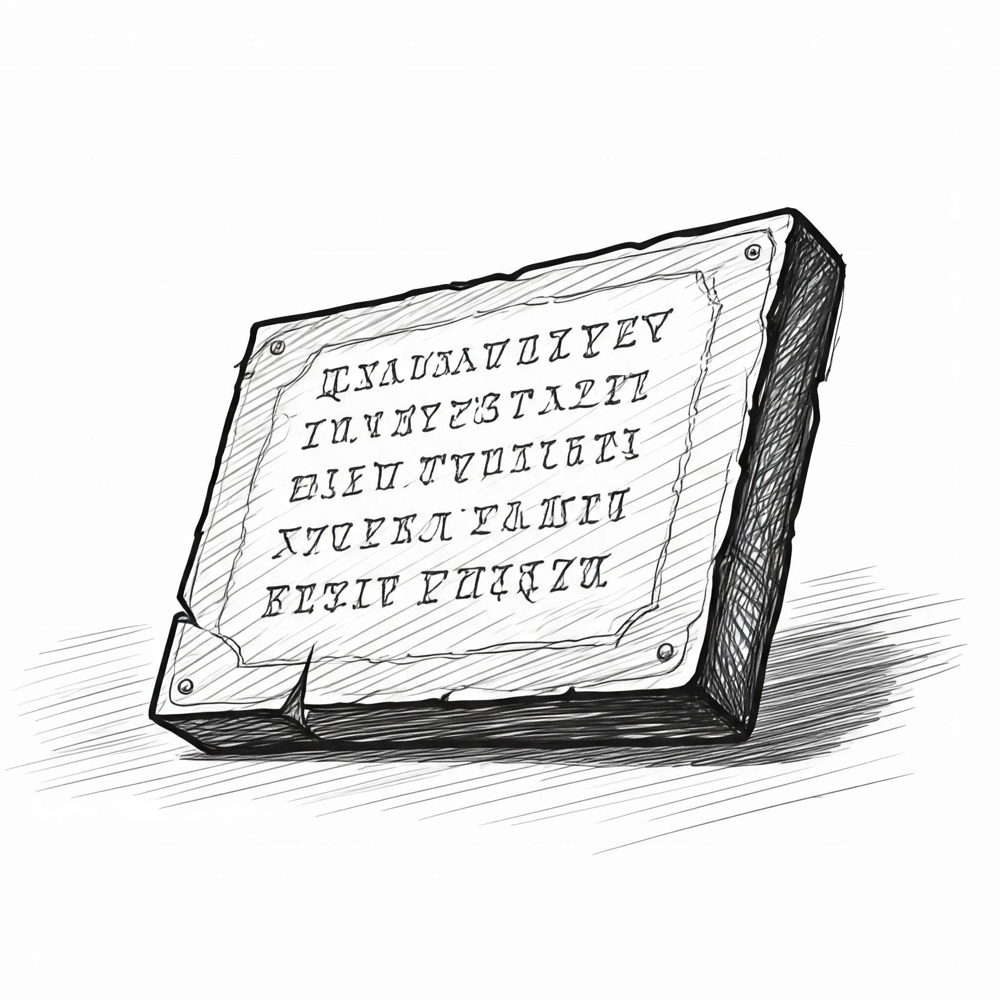

# Aplicaciones web con Python

## Manipulación de texto

### 2005 - Instituto Tecnológico de Mexicali




---

<!--
paginate: true
header: Aplicaciones web con Python
footer: Instituto Tecnológico de Mexicali
-->
# Texto en Python

- Sólo hay un tipo de datos para texto: `str`.
  - ***Inmutable***
  - Indexable (***slice***)
- El texto se delimita por comillas simples (`'`) o comillas dobles (`"`).
- Múltiples líneas:
  - `\n`
  - Delimitado por tres comillas simples/dobles: `'''` / `"""`
- No hay tipo de datos para caracteres (`char`) debido a que por default, el codificado de texto en Python 3 es UTF-8 y ya no se puede asumir que un caracter tenga 8 bytes.

---


# Ejemplo 1

```python
>>> '' == str() == ""
True
>>> 'hola mundo'
'hola mundo'
>>> " ' "
" ' "
>>> ' " '
' " '
>>> '"' == "\""
True
>>> "'" == '\''
True
```

---

# El texto tiene una longitud


```python
cadena = "longitud"
longitud = len(cadena)  # Resultado: 8
```

---

# El texto es **indexable**

```python
>>> a = 'Pera'
```

<div class="columnas">
<div class="col">

| `P` | `e` | `r` | `a` |
|---|---|---|---|
| 0 | 1 | 2 | 3 |
|-4 |-3 |-2 |-1 |

</div>
<div class="col">
De izquierda a derecha

```python
>>> a[0]
'P'
```

O de derecha a izquierda

```python
>>> a[-1]
'a'
```
</div>
</div>

---

# El texto es inmutable


```python
>>> a = 'foo bar'
>>> a[2] = 'z'
Traceback (most recent call last):
  File "<python-input-35>", line 1, in <module>
    a[2] = 'z'
    ~^^^
TypeError: 'str' object does not support item assignment
>>>
```

---

# ¿Cómo modificar cadenas?

<div class="columnas">
<div class="col">

- Usar `.replace()`
  ```python
  >>> 'Mansana'.replace('s', 'z')
  'Manzana'
  ```
- Convertir a lista y luego a cadena
  ```python
  >>> z = list('Mansana')
  >>> z[3] = 'z'
  >>> ''.join(z)
  'Manzana'
  ```

</div>
<div class="col">

- Slicing
  ```python
  >>> fruta = 'Mansana'
  >>> fruta[:3] + 'z' + fruta[4:]
  'Manzana'
  ```

</div>
</div>


---

# Texto con líneas múltiples

```python
>>> a = """
... Cadena con multiples lineas.
... Puede contener " y ' sin problemas.
... """
'\nCadena con multiples lineas.\nPuede contener " y \' sin problemas.\n'
>>> print(a)
Cadena con multiples lineas.
Puede contener " y ' sin problemas.
```

---

# Texto con acentos y caracteres especiales

```python
>>> 'áéíóúñ⌚⏰✅'
'áéíóúñ⌚⏰✅'
```

---

# Concatenación 

Usando `+`

```python
cadena1 = "Hola"
cadena2 = "Mundo"
resultado = cadena1 + " " + cadena2
print(resultado)  # Resultado: "Hola Mundo"
```

---

# Formateo (f-strings)

Inserta variables directamente en la cadena.

```python
nombre = "Ana"
edad = 30
mensaje = f"Hola, me llamo {nombre} y tengo {edad} años."
print(mensaje)  # Resultado: "Hola, me llamo Ana y tengo 30 años."
```
  
---

# Repetición

Repetir una cadena usando `*`

```python
cadena = "Python"
resultado = cadena * 3
print(resultado)  # Resultado: "PythonPythonPython"
```

---

# Convertir a mayúsculas y minúsculas

<div class="columnas">
<div class="col">

*   `.upper()`: A mayúsculas.

    ```python
    cadena = "hola"
    mayusculas = cadena.upper()
    print(mayusculas)  # Resultado: "HOLA"
    ```

*   `.lower()`: A minúsculas.

    ```python
    cadena = "ADIOS"
    minusculas = cadena.lower()
    print(minusculas)  # Resultado: "adios"
    ```


</div>
<div class="col">

*   `.title()`: La primera letra a mayúsculas.

    ```python
    cadena = "ADIOS"
    title = cadena.title()
    print(title)  # Resultado: "Adios"
    ```

*   `.swapcase()`: Invertir mayúsculas/minúsculas.

    ```python
    cadena = "ManzanA"
    print("ManzanA".swapcase())  # Resultado: "mANZANa"
    ```

</div>
</div>


---

# Otras operaciones

*   `.strip()`: Quita espacios al inicio y final.

    ```python
    cadena = "   espacios   "
    sin_espacios = cadena.strip()
    print(sin_espacios)
    ```

*   `.replace(viejo, nuevo)`: Reemplaza una subcadena.

    ```python
    cadena = "manzana verde"
    nueva_cadena = cadena.replace("verde", "roja")
    print(nueva_cadena)
    ```

---

# Otras operaciones

*   `.split(separador)`: Divide la cadena en una lista.

    ```python
    cadena = "uno,dos,tres"
    lista = cadena.split(",")
    print(lista) # Resultado: ['uno', 'dos', 'tres']
    ```

*   `.join(iterable)`: Une una secuencia con un separador.

    ```python
    lista = ['a', 'b', 'c']
    cadena = "-".join(lista)  # Resultado: "a-b-c"
    ```

---

### Secuencias de escape

*   `\n`: Nueva línea.
*   `\t`: Tabulación.
*   `\\`: Barra invertida.
*   `\'`: Comilla simple.
*   `\"`: Comilla doble.

---

# Resúmen

- Las cadenas de texto (strings) en Python representan secuencias inmutables de caracteres Unicode.
- Se utilizan para almacenar y manipular texto, desde simples palabras hasta extensos párrafos.
- Permiten operaciones como concatenación, formateo, búsqueda de subcadenas y conversión a mayúsculas/minúsculas.
- Son esenciales para la entrada/salida de datos, procesamiento de texto y manipulación de información textual.

---

# Siguiente: [Estructuras de datos: **Secuencias** →](106-Estructuras-de-datos-secuencias.md)

