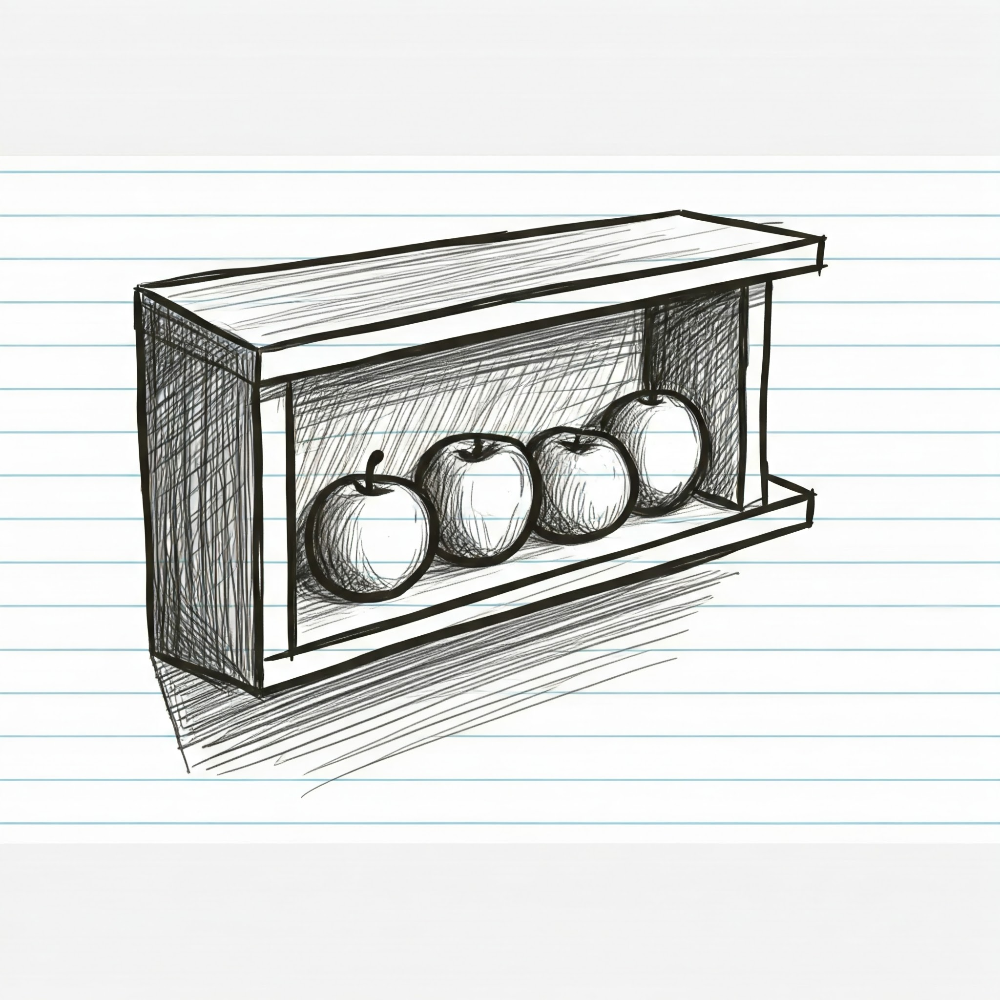

# Aplicaciones web con Python

## Estructuras de datos: **Secuencias**

### 2005 - Instituto Tecnológico de Mexicali

#### https://tinyurl.com/pyitm2025


---
<!--
paginate: true
header: Aplicaciones web con Python
footer: Instituto Tecnológico de Mexicali
-->

# Estructuras de datos

- ***Secuencia***: un conjunto ordenado de objetos
  - tuplas (`tuple`)
  - listas (`list`)
  - texto (`str`)
  - Datos binarios (`bytes`, `bytearray`)
  - 

---

# Operaciones comunes de secuencias

Si el objeto es una secuencia, es muy probable que soporte estas operaciones (en orden de prioridad):

|       Operación      |                                         Resultado                                         |
|:--------------------:|:-----------------------------------------------------------------------------------------:|
|        `x in s`      | **Pertenencia**: `True` si un elemento de `s` es igual a `x`, `False` en caso contrario.    |
|      `x not in s`    | **No pertenencia**: `False` si un elemento de `s` es igual a `x`, `True` en caso contrario  |
|        `s + t`       | **Concatenación** de `s` y `t`                                                              |
|   `s * n` ó `n * s`  | **Repeticion**: equivalente a sumar o repetir `s` a sí mismo `n` veces                      |

---

# Operaciones comunes de secuencias


|       Operación        |                                         Resultado                                         |
|:----------------------:|:-----------------------------------------------------------------------------------------:|
|         `s[i]`         | **Indexado**: i-ésimo elemento de `s`, origen `0`                          |
|        `s[i:j]`        | **Rebanada**: Una sub-secuencia de `s` a partir del i-ésimo elemento `i` hasta `j`        |
|       `s[i:j:k]`       | **Rebanada en pasos**:  `s` desde `i` hasta `j`, en pasos de tamaño `k`      |
|        `len(s)`        |                                       **Longitud** de `s`                                   |
|        `min(s)`        |                                 El elemento **más pequeño** de `s`                             |
|        `max(s)`        |                                 El elemento **más grande de** `s`                             |


---

# Operaciones comunes de secuencias


|       Operación        |                                         Resultado                                         |
|:----------------------:|:-----------------------------------------------------------------------------------------:|
| `s.index(x[, i[, j]])` | **Búsqueda**: índice de la primera aparición de `x` en `s` (en, o después del índice `i` y antes del índice `j`) |
|      s.count(x)        | **Conteo de elementos**:  número total de apariciones de `x` en `s`                           |

---

# Ordenamiento y comparación en secuencias

> Las secuencias ***del mismo tipo*** también admiten comparaciones. En particular, las tuplas y las listas se comparan lexicográficamente comparando los elementos correspondientes. Esto significa que, para que sean iguales, cada elemento debe ser igual y las dos secuencias deben ser del mismo tipo y tener la misma longitud. (Para obtener detalles completos, consulta la sección de [Comparaciones](https://docs.python.org/3/reference/expressions.html#comparisons) en la referencia del lenguaje).

---

# Desempaquetado (Unpacking)

<div class="columnas">
<div class="col">

- El **desempaquetado** es la asignación de los elementos de una secuencia a variables individuales ***en un solo paso***, sin tener que acceder a sus elementos uno por uno.

  ```python
  tupla = (100, 200)
  x, y = tupla
  print(f'x={x}, y={y}') # Imprime: x = 100, y = 200
  ```

</div>
<div class="col">

- El desempaquetado también funciona con un número variable de elementos usando el operador `*`:

  ```python
  tupla = (1, 2, 3, 4, 5)
  primero, *resto, ultimo = tupla
  print(f'primero={primero}, último={ultimo}, el resto = {resto}')
  # Imprime: primero=1, último=5, el resto = [2, 3, 4]
  ```

</div>
</div>


---

# Tuplas

> Una secuencia inmutable de objetos con un número ***limitado*** de elementos.
> 



---

# Creación de tuplas

<div class="columnas">
<div class="col">

* Se definen usando paréntesis `()` o simplemente separando los elementos con comas.

  ```python
  tupla1 = (1, 2, 3)
  tupla2 = 4, 5, 6  # Equivalente a (4, 5, 6)
  tupla_vacia = () # Tupla vacía
  tupla_un_elemento = (5,) # Tupla con un solo elemento. La coma es necesaria.
  ```

</div>
<div class="col">

- En Python, todo es un objeto, asi que las tuplas pueden contener elementos de cualquier tipo.

  ```python
  # Tupla con un entero, una cadena y un número de punto flotante
  tupla_mixta1 = (10, "Hola", 3.14)
  print(tupla_mixta1)  # Imprime: (10, 'Hola', 3.14)
  print(type(tupla_mixta1)) # Imprime: <class 'tuple'>
  ```

</div>
</div>

---

# Las tuplas son **inmutables**

Las tuplas son *inmutables*. Una vez creadas, no se pueden modificar sus elementos (no se pueden añadir, eliminar ni modificar elementos directamente).


```python
>>> tupla = (1, 2, 3)
>>> tupla[0] = 10
Traceback (most recent call last):
  File "<python-input-43>", line 1, in <module>
    tupla[0] = 10
    ~~~~~^^^
TypeError: 'tuple' object does not support item assignment
```

---

# Pertenencia y no pertenencia

```python
tupla = (1, "a", 3.14)
```

<div class="columnas">
<div class="col">

- Pertenencia:
  ```python
  print(1 in tupla)       # True
  print("a" in tupla)     # True
  print(2 in tupla)       # False
  ```

</div>
<div class="col">

- No pertenencia:
  ```python
  print(1 not in tupla)   # False
  print("b" not in tupla) # True
  print(2 not in tupla)   # True
  ```

</div>
</div>


---

# Concatenación

Ya que las tuplas son *inmutables*, el operador `+` siempre crea nuevas tuplas a partir de otras.

```python
tupla1 = (1, 2)
tupla2 = (3, 4)
tupla_concatenada = tupla1 + tupla2
print(tupla_concatenada)  # Imprime: (1, 2, 3, 4)
print(id(tupla1))  # Imprime: 1732371591616 (es diferente en cada maquina)
print(id(tupla2))  # Immprime: 1732371610688
print(id(tupla_concatenada))  # Imprime 1732371564400
```

---

# Repetición

Podemos repetir una tupla usando el operador `*`.

```python
tupla = ('a', 'b')
tupla_repetida = tupla * 3
print(tupla_repetida)  # Imprime: ('a', 'b', 'a', 'b', 'a', 'b')
```

---

# Rebanadas e índices

*   **Acceso por índice:** Similar al texto, se accede a los elementos mediante su índice (comenzando desde 0).

    ```python
    tupla = (10, 20, 30)
    primer_elemento = tupla[0]  # Resultado: 10
    segundo_elemento = tupla[1]  # Resultado: 20
    ```

*   **Slicing (Rebanado):** Extraer sub-tuplas.

    ```python
    tupla = (1, 2, 3, 4, 5)
    subtupla = tupla[1:4]  # Resultado: (2, 3, 4)
    subtupla2 = tupla[:3] # Resultado: (1, 2, 3)
    subtupla3 = tupla[2:] # Resultado: (3, 4, 5)
    ```

---

# Tamaño de una tupla

```python
tupla = (1, 2, 3, 4)
longitud = len(tupla)  # Resultado: 4
```

---


# Maximos y minimos

<div class="columnas">
<div class="col">


- **En números**
  ```python
  tupla = (5, 2, 8, 1, 9, 4)

  maximo = max(tupla)
  minimo = min(tupla)

  print(f"El máximo es: {maximo}")  # Imprime: El máximo es: 9
  print(f"El mínimo es: {minimo}")  # Imprime: El mínimo es: 1
  ```

> La comparación entre números es por valor

</div>
<div class="col">

- **En cadenas**
  ```python
  tupla_cadenas = ("manzana", "banana", "cereza", "dátil")

  maximo = max(tupla_cadenas)  # Resultado: "manzana" (orden alfabético)
  minimo = min(tupla_cadenas)  # Resultado: "banana" (orden alfabético)

  print(f"La cadena máxima (alfabéticamente) es: {maximo}")
  print(f"La cadena mínima (alfabéticamente) es: {minimo}")
  ```

  > La comparación entre cadenas es lexicográfica.
  >

</div>
</div>

---

# Conteo de elementos en una tupla

`count(elemento)` cuenta cuántas veces aparece un elemento en la tupla.

```python
tupla = (1, 2, 2, 3, 2)
cantidad_de_dos = tupla.count(2)
print(cantidad_de_dos)  # Imprime: 3
```

---

# Búsqueda

- `index(elemento)`: Devuelve el índice de la primera aparición de un elemento. 

  ```python
  tupla = ('a', 'b', 'c')
  indice_de_b = tupla.index('b')
  print(f"La letra b esta en el índice: {indice_de_b}")
  # Imprime: La letra b esta en el índice: 1
  ```
- Lanza un `ValueError` si el elemento no está presente.
  ```python
    >>> tupla.index('z')
  Traceback (most recent call last):
    File "<python-input-41>", line 1, in <module>
      tupla.index('z')
      ~~~~~~~~~~~^^^^^
  ValueError: tuple.index(x): x not in tuple
  ```

---


# Listas


> Una secuencia ***mutable*** de objetos con un número ***ilimitado*** de elementos.


---

# Creación de listas

<div class="columnas">
<div class="col">

* Se definen usando corchetes `()` y separando los elementos con `,`.

  ```python
  lista1 = [1, 2, 3]
  lista_vacia = [] # lista vacía
  lista_un_elemento = [1,] # lista con un solo elemento. La coma es opcional.
  ```

</div>
<div class="col">

- En Python, todo es un objeto, asi que las listas pueden contener elementos de cualquier tipo.

  ```python
  # Lista con un entero, una cadena y un número de punto flotante
  lista_mixta = [10, "Hola", 3.14]
  print(lista_mixta)  # Imprime: [10, 'Hola', 3.14]
  print(type(lista_mixta)) # Imprime: <class 'list'>
  ```
</div>
</div>

---

# Las listas son ***mutables***

```python
mi_lista = [1, 2, 3]

mi_lista[0] = 10     # Modificamos el primer elemento (índice 0)

print(mi_lista)      # Imprime: [10, 2, 3]
```

---

# Pertenencia y no pertenencia

```python
mi_lista = [1, "a", 3.14]
```
<div class="columnas">
<div class="col">

- Pertenencia:
  ```python
  print(1 in mi_lista)       # True
  print("a" in mi_lista)     # True
  print(2 in mi_lista)       # False
  ```

</div>
<div class="col">

- No pertenencia:
  ```python
  print(1 not in mi_lista)   # False
  print("b" not in mi_lista) # True
  print(2 not in mi_lista)   # True
  ```

</div>
</div>

---

# Concatenación

Aunque las listas son *mutables*, el operador `+` va a crear una nueva lista a partir de otras, dejando las originales intactas

```python
lista1 = [1, 2]
lista2 = [3, 4]
lista_concatenada = lista1 + lista2
print(lista_concatenada)  # Imprime: [1, 2, 3, 4]
print(id(lista1))
print(id(lista2))
print(id(lista_concatenada))
```

---

# Repetición

Podemos repetir una lista usando el operador `*`.

```python
lista = ['a', 'b']
lista_repetida = lista * 3
print(lista_repetida)  # Imprime: []'a', 'b', 'a', 'b', 'a', 'b']
```

---

# Tamaño de una lista

```python
lista = [1, 2, 3, 4]
longitud = len(lista)  # Resultado: 4
```

---


# Maximos y minimos

<div class="columnas">
<div class="col">


- **En números**
  ```python
  lista = [5, 2, 8, 1, 9, 4]

  maximo = max(lista)
  minimo = min(lista)

  print(f"El máximo es: {maximo}")  # Imprime: El máximo es: 9
  print(f"El mínimo es: {minimo}")  # Imprime: El mínimo es: 1
  ```

> La comparación entre números es por valor

</div>
<div class="col">

- **En cadenas**
  ```python
  lista_cadenas = ["manzana", "banana", "cereza", "dátil"]

  maximo = max(lista_cadenas)  # Resultado: "manzana" (orden alfabético)
  minimo = min(lista_cadenas)  # Resultado: "banana" (orden alfabético)

  print(f"La cadena máxima (alfabéticamente) es: {maximo}")
  print(f"La cadena mínima (alfabéticamente) es: {minimo}")
  ```

  > La comparación entre cadenas es lexicográfica.
  >

</div>
</div>

---

# Conteo de elementos en una lista

`count(elemento)` cuenta cuántas veces aparece un elemento en la lista.

```python
lista = [1, 2, 2, 3, 2]
cantidad_de_dos = lista.count(2)
print(cantidad_de_dos)  # Imprime: 3
```

---

# Búsqueda

- `index(elemento)`: Devuelve el índice de la primera aparición de un elemento. 

  ```python
  lista = ['a', 'b', 'c']
  indice_de_b = lista.index('b')
  print(f"La letra b esta en el índice: {indice_de_b}")
  # Imprime: La letra b esta en el índice: 1
  ```
- Lanza un `ValueError` si el elemento no está presente.
  ```python
  >>> lista.index('z')
  Traceback (most recent call last):
    File "<python-input-86>", line 1, in <module>
      lista.index('z')
      ~~~~~~~~~~~^^^^^
  ValueError: 'z' is not in list
  ```


---

## Tuplas vs Listas vs Texto

| Tuplas                               | Listas                               | Texto |
|--------------------------------------|------------------------------------- | ------------ |
| Colección ***finita*** de objetos    | Colección ***infinita***  de objetos | Secuencia de ***puntos de codigo*** unicode. |
| Delimitado por `()` (opcional)       | Delimitado por `[]`                  | Delimitado por `'` o `"` |
| **Inmutable**                        | **Mutable**                          | **Inmutable** |

---

# Resúmen

- Las secuencias en Python (listas, tuplas, texto) son estructuras de datos que almacenan colecciones ordenadas de elementos, accesibles mediante índices.
- Se utilizan para representar conjuntos de datos donde el orden es importante, permitiendo iterar sobre los elementos, acceder a ellos individualmente mediante su posición, realizar rebanado (slicing) y otras operaciones como concatenación y repetición.
- Su mutabilidad (listas) o inmutabilidad (tuplas, texto) determina si pueden modificarse después de su creación.

---

# Siguiente: [Estructuras de datos: **Colecciones** →](107-Estructuras-de-datos-colecciones.md)

