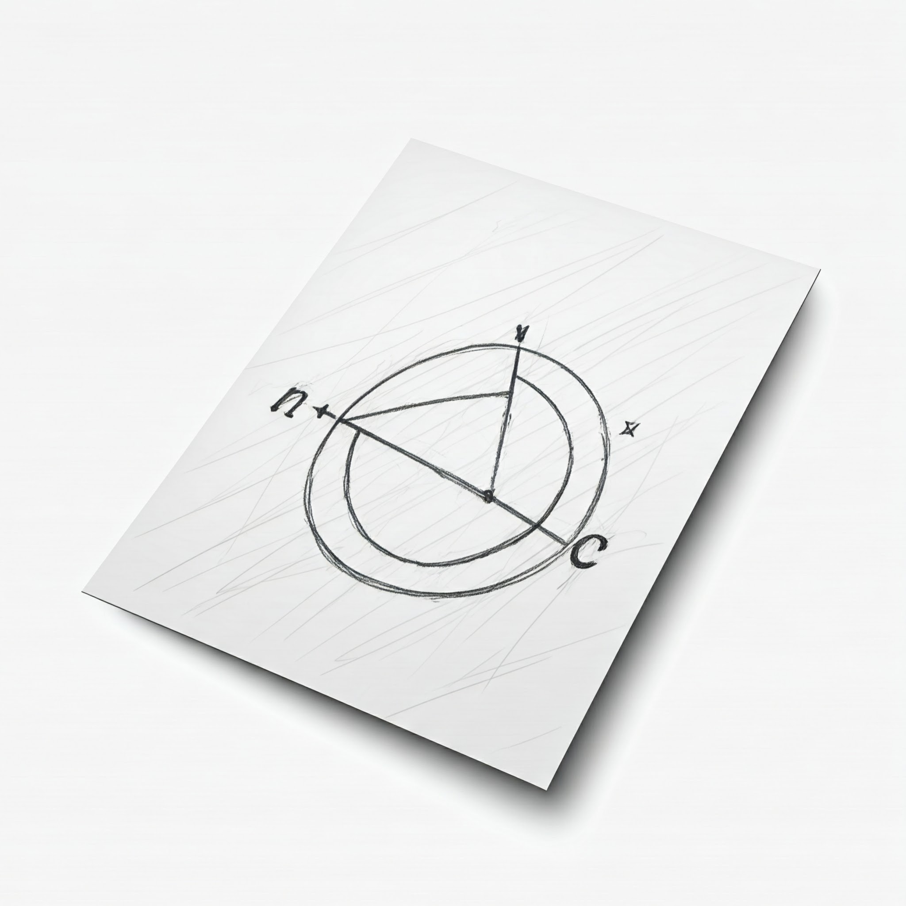

# Aplicaciones web con Python

## Funciones

### 2005 - Instituto Tecnológico de Mexicali



---

<!--
paginate: true
header: Aplicaciones web con Python
footer: Instituto Tecnológico de Mexicali
-->

# Funciones

Las funciones son bloques de código que se ejecutan solamente cuando son invocadas.

```python
def nombre_funcion(...):
    """
    Documentacion de la funcion, parámetros, comportamiento, tipo de valor retornado.
    """
    ...
    return algun_valor
```

---

# Definiendo funciones

<div class="columnas">
<div class="col">

- Usar la palabra reservada `def`
- Los nombres de las funciones siguen las mismas reglas que los nombres de las variables.
- Los parámetros de la función van dentro de los paréntesis `()`, separados por comas `,`. Al cerrar los paréntesis, escribir `:` para indicar que a continuación viene la implementación de la función.
</div>
<div class="col">

- Opcionalmente define un docstring en las siguientes líneas.
- Lista de sentencias dentro del cuerpo de la función
- La función termina cuando ya no hay más sentencias que ejecutar, se encontró `return` u ocurrió una excepción.
</div>
</div>

---

# Terminación de una función

La función termina cuando:

- Ya no hay más sentencias que ejecutar
- Se encontró `return`, con o sin valor.
- Ocurrió una excepción.

---

# Definiendo una función vacía

```python
def yo_no_hago_nada():
    pass

def yo_tampoco():
    """
    Yo tampoco hago nada
    """
```

---

# Funciones sin parámetros ni valor de retorno

Son las mas sencillas de definir. No toman ningun parámetro ni regresan ningún valor.

```python
def ladrar():
    print("woof")
    
def maullar():
    print("mrrmiau")
>>> ladrar()
Woof
>>> maullar()
mrrmiau
```

---

# El valor de retorno

En Python, las funciones ***siempre*** retornan un valor, que por defecto es `None`

```python
def yo_no_hago_nada():
    pass

foo = yo_no_hago_nada()
print(foo) # Imprime None
```
> Aunque una función regrese un valor, si este no se asigna a una variable, ese valor se ignora

---

# Definiendo el valor de retorno

<div class="columnas">
<div class="col">

- Para cambiar el valor retornado de una función se usa `return`

    ```python
    def dos_mas_dos():
        return 4

    print(dos_mas_dos())  # Imprime 4
    ```

</div>
<div class="col">

- El valor por defecto de `return` es `None`.

    ```python
    def dos_mas_dos():
        return

    print(dos_mas_dos())  # Imprime None
    ```

</div>
</div>


---

# Parámetros

- **Posicionales**. Siempre son requeridos y deben darse en el orden en el que fueron definidos.
- **Opcionales**, con un valor predefinido. No son requeridos. Los parámetros con valores predeterminados deben ir después de los parámetros posicionales.
- Parámetros con nombre (o *palabras clave* - *keywords*)
- Parámetros de longitud variable (`*args`)
- Parámetros de palabras clave variables (`**kwargs`)


---

# Parámetros posicionales (o requeridos)

- Son los parámetros más comunes y se definen simplemente listándolos dentro de los paréntesis de la definición de la función.
- El orden en que se pasan los argumentos al llamar a la función debe coincidir con el orden en que se definieron los parámetros.
- Son **obligatorios**, a menos que se les asigne un valor por defecto.


---

# Función con un parámetro

<div class="columnas">
<div class="col">

```python
def cubo(n):
    """
    Eleva un número al cubo
    """
    return n**3

print(cubo(8)) # Imprime 512
```
</div>
<div class="col">

- Parámetro posicional


```python
cubo()
Traceback (most recent call last):
  File "<pyshell#42>", line 1, in <module>
    cubo()
TypeError: cubo() missing 1 required positional argument: 'n'
```
</div>
</div>

---

# Función con un parámetro

## Los tipos de datos son dinámicos

El resultado de `cubo()` dependerá de si el objeto soporta la operación de potencia.


```python
print(cubo(8.1)) # Imprime 531.4409999999999
print(cubo(1 + 2j))  # Imprime (-11-2j)

print(cubo('x'))
Traceback (most recent call last):
  File "<pyshell#45>", line 1, in <module>
    print(cubo('x'))
  File "<pyshell#41>", line 5, in cubo
    return n**3
TypeError: unsupported operand type(s) for ** or pow(): 'str' and 'int'
```

---

# Función con multiples parametros


```python
def hipotenusa(a, b):
    return (a**2 + b**2)**0.5

print(hipotenusa(2,2)) # Imprime 2.8284271247461903
```


---

# Parámetros opcionales

Son parámetros con valores predeterminados (o por defecto):

- Se definen asignando un valor a un parámetro en la definición de la función.
- Si al llamar a la función no se proporciona un argumento para un parámetro con valor predeterminado, se utiliza el valor por defecto.
- Los parámetros con valores predeterminados deben ir después de los parámetros posicionales.


---

# Parámetros opcionales - Ejemplo

En la siguiente función, `mensaje` tiene un valor predeterminado. Puedo proporcionarlo o no.
```python
def saludar(nombre, mensaje="Hola"):
    print(f"{mensaje}, {nombre}!")

saludar("Ana")                  # Imprime "Hola, Ana!"
saludar("Pedro", "Buenos días") # Imprime "Buenos días, Pedro!"
```

---

# Parámetros con nombre (o palabras clave - keywords)

```python
def describir_persona(nombre, edad, ciudad):
    print(f"{nombre} tiene {edad} años y vive en {ciudad}.")

```

- Al llamar a una función, se pueden especificar los argumentos usando el nombre del parámetro, seguido del signo igual (`=`) y el valor.
- Esto permite pasar los argumentos en ***cualquier orden***, lo que mejora la legibilidad, especialmente cuando hay muchos parámetros.

---

# Parámetros con nombre (o palabras clave - keywords)

La función `describir_persona()` se puede invocar de la siguiente manera:

```python
describir_persona(nombre="Carlos", ciudad="Mexicali", edad=25)
# Imprimirá "Carlos tiene 25 años y vive en Mexicali."
```

También se pueden combinar parámetros posicionales con parámetros con nombre, ***pero los posicionales deben ir primero***.

```python
describir_persona("Laura", ciudad="Yucatán", edad=30)
# Imprimirá: "Laura tiene 30 años y vive en Yucatán."
```

---

# Parámetros de longitud variable (`*args`):

- Se utilizan para pasar un número variable de argumentos posicionales a una función.
- Se representan con un asterisco (`*`) seguido de un nombre (por convención se usa `args`).
- Dentro de la función, `args` se trata como una **tupla** que contiene todos los argumentos posicionales adicionales.


---

# Parámetros de longitud variable

```python
def sumar(*numeros):
    suma = 0
    for numero in numeros:
        suma += numero
    return suma
```
Invocando `sumar()` con 3, 5 y cero argumentos.

```python
print(sumar(1, 2, 3))       # 3 argumentos. Imprime 6
print(sumar(1, 2, 3, 4, 5))  # 5 argumentos. Imprime 15
print(sumar())             # Sin argumentos. Imprime 0
```

---

# Parámetros de palabras clave variables (`**kwargs`):

- Se utilizan para pasar un número variable de argumentos con nombre a una función.
- Se representan con dos asteriscos (`**`) seguidos de un nombre (por convención se usa `kwargs`).
- Dentro de la función, `kwargs` se trata como un **diccionario** donde las ***llaves*** son los nombres de los parámetros y los ***valores*** son los argumentos correspondientes.

---

# Parámetros de palabras clave variables

```python
def mostrar_datos(**datos):
    for clave, valor in datos.items():
        print(f"{clave}: {valor}")
```
Puedo pasar las palabras clave directamente por nombre
```python
mostrar_datos(nombre="Elena", edad=28, profesion="Ingeniera")
```
Salida:
```
nombre: Elena
edad: 28
profesion: Ingeniera
```
---


# Parámetros de palabras clave variables

Alternativamente puedo pasar las palabras clave indirectamente usando un diccionario.

<div class="columnas">
<div class="col">

```python
empleado={'nombre':"Fernando", 'edad':31, 'profesion':"Contador"}
mostrar_datos(**empleado)
```
</div>
<div class="col">

```python
mostrar_datos(**{'nombre':"Fernando", 'edad':31, 'profesion':"Contador"})
```
</div>
</div>

Ambos imprimen:

```
nombre: Fernando
edad: 31
profesion: Contador
```

---

# Combinación de tipos de parámetros

Es posible combinar varios tipos de parámetros en una misma función, pero se debe seguir un orden específico:

1. Parámetros posicionales.
1. Parámetros con valores predeterminados
1. Parametros posicionales variables (`*args`).
1. Parámetros solo de palabra clave (*keyword-only arguments*).
1. Parametros de palabra clave variables (`**kwargs`).

---

# Combinación de tipos de parámetros - ejemplo

```python
def funcion_compleja(a, b, *args, c, d=4, **kwargs):
    print(f"a: {a}, b: {b}")
    print(f"args: {args}")
    print(f"c: {c}, d: {d}")
    print(f"kwargs: {kwargs}")
```
Ejemplos de invocación de `funcion_compleja()`

```python
funcion_compleja(1, 2, 3, 4, c=5, nombre="Juan", apellido="Perez")
funcion_compleja(1, 2, 3, 4, 5, c=6, nombre="Juan", apellido="Perez")
```

---

# Función con parametros Keyword only

```python
def funcion_keyword_only(a, b, *, c):
    print(f"a: {a}, b: {b}, c:{c}")
```
Invocación correcta:

```python
funcion_keyword_only(1,2, c=3) # Imprime a: 1, b: 2, c:3
```

Invocación incorrecta (c debe ser pasado como keyword)
```python
funcion_keyword_only(1,2, 3)
Traceback (most recent call last):
  File "<pyshell#95>", line 1, in <module>
    funcion_keyword_only(1,2, 3)
TypeError: funcion_keyword_only() takes 2 positional arguments but 3 were given

```

---

# ¿Los parámetros se pasan por referencia o por valor?

En Python todos los parámetros se pasan por referencia
- Si el objeto es **inmutable**, las modificaciones dentro de la función no afectan a la variable original.
- Si el objeto es **mutable**, las modificaciones dentro de la función sí afectan a la variable original.


---

# Parámetro inmutable

```python
def duplica(x):
    x = x*2
    return x
```

<div class="columnas">
<div class="col">

```python
a1 = 7
a2 = duplica(a1)
print(a1, a2)
7 14
```

</div>
<div class="col">

- `a1` es inmutable (un entero)
- Dentro de la función se crea un nuevo objeto en memoria, el objeto se clona.
- El nuevo resultado es asignado a `a2`
</div>
</div>

---

# Parámetro inmutable (tupla)

```python
def duplica(x):
    x = x*2
    return x
```

<div class="columnas">
<div class="col">

```python
t1 = (7,2)
t2 = duplica(t1)
print(t1, t2)
(7, 2) (7, 2, 7, 2)
```

</div>
<div class="col">

- `t1` es inmutable (una tupla)
- Dentro de la función se crea un nuevo objeto en memoria, el objeto se clona.
- El nuevo resultado es asignado a `t2`
</div>
</div>

---

# Parámetro mutable (lista)

```python
def duplica(x):
    x = x*2
    return x
```

<div class="columnas">
<div class="col">

```python
l1 = [7,2]
l2 = duplica(l1)
print(l1, l2)
(7, 2) (7, 2, 7, 2)
```

</div>
<div class="col">

- `l1` es mutable (una lista)
- Pero dentro de la función se sigue creando un nuevo objeto en memoria a partir de la lista original.
- El nuevo resultado es asignado a `l2`
</div>
</div>

---

# Cambiamos el operador, de `*` a `+=`

```python
def duplica(x):
    x += x
    return x
```

<div class="columnas">
<div class="col">

```python
duplica(5)
10

t1 = (7,2)
t2 = duplica(t1)
print(t1, t2)
(7, 2) (7, 2, 7, 2)

l1 = [7,2]
l2 = duplica(l1)
print(l1, l2)
[7, 2, 7, 2] [7, 2, 7, 2]
id(l1) == id(l2)
True
```

</div>
<div class="col">

- `5` y `t1` son ***inmutables***, el operador `+=` "sabe" que son inmutables y crea una nueva instancia del objeto para acomodar el resultado.
- `l1` es mutable (una lista), el operador `+=` entonces usa `append()` en la lista. No se creo un objeto nuevo, así que `l2` es otro nombre para `l1`. Esto se e
- Dentro de la función .
- El nuevo resultado es asignado a `l2`

</div>
</div>

---

# Cambiamos el operador, de `*` a `+=`

```python
def duplica(x):
    x += x
    return x
```

<div class="columnas">
<div class="col">

```python
l1 = [7,2]
l2 = duplica(l1)
print(l1, l2)
[7, 2, 7, 2] [7, 2, 7, 2]
id(l1) == id(l2)
True
```

</div>
<div class="col">

- `l1` es mutable (una lista), el operador `+=` entonces usa `append()` en la lista. No se creo un objeto nuevo, así que `l2` es otro nombre para `l1`.
- `id(l1) == id(l2)` demuestra que son el mismo objeto en memoria

</div>
</div>

---

# Las funciones son objetos

> En Python, todo es un objeto

<div class="columnas">
<div class="col">

```python
def mi_funcion():
    print('Hola')

mi_funcion()
Hola
```
</div>
<div class="col">

- ¿Qué pasa si imprimo la función?
    ```python
    print(mi_funcion)
    <function mi_funcion at 0x000001BD91C3BF60>
    ```
- Puedo asignar la función a otra variable
    ```python
    hola = mi_funcion
    hola()
    Hola
    ```

</div>
</div>


---

# Funciones de orden superior

[Wikipedia](https://es.wikipedia.org/wiki/Funci%C3%B3n_de_orden_superior)

> En matemáticas y ciencias de la computación funciones de orden superior son funciones que cumplen **al menos una** de las siguientes condiciones:
>    - Tomar una o más funciones como entrada
>    - Devolver una función como salida

---

# Ejemplo de función de orden superior


<div class="columnas">
<div class="col">

- En este ejemplo, `ecuacion_lineal` regresa funcion que calcula los puntos de una linea, donde `a` es la pendiente y `b` es el *offset* u ordenada de orígen.

```python
def ecuacion_lineal(a, b):
    def funcion(x):
        return a * x + b
    return funcion

linea1 = ecuacion_lineal(2,5)
print(linea1(0), linea1(-5), linea1(5))
# Imprime: 5 -5 15
```

</div>
<div class="col">

- En este otro ejemplo `saludar` toma una función como parámetro.

```python
def gritar(texto): 
    return texto.upper() 
  
def susurrar(texto): 
    return texto.lower() 
  
def saludar(func):  
    print(func("Hola perrito"))  
  
saludar(gritar) # Imprime: HOLA PERRITO
saludar(susurrar) # Imprime: hola perrito
```
</div>
</div>

---

# Decoradores


- Los decoradores modifican o extienden el comportamiento de funciones sin alterar su código fuente directamente.
- Es el uso más comun de las funciones de orden superior
- En Python, los decoradores se usan con el operador `@`

---

# Ejemplo simple de un decorador en Python

Este ejemplo crea un decorador que imprime un mensaje antes y después de ejecutar una función.

<div class="columnas">
<div class="col">

```python
def mi_decorador(funcion):
    def funcion_envolvente(*args, **kwargs):
        print("Antes de llamar a la función.")
        resultado = funcion(*args, **kwargs)
        print("Después de llamar a la función.")
        return resultado
    return funcion_envolvente

@mi_decorador
def saludar(nombre):
    return f"Hola, {nombre}!"

@mi_decorador
def sumar(a,b):
    return a + b
```

</div>
<div class="col">

```python
>>> saludo = saludar("Juan")
Antes de llamar a la función.
Después de llamar a la función.
>>> print(saludo)
Hola, Juan

>>> suma_resultado = sumar(5,3)
Antes de llamar a la función.
Después de llamar a la función
>>> print(suma_resultado)
8
```

</div>
</div>


---

# Funciones lambda


Las funciones lambda son funciones anónimas (sin nombre) que se definen en una sola línea usando la palabra clave `lambda`. Se usan para crear funciones pequeñas y concisas, a menudo como argumentos para otras funciones (como `map`, `filter`, `sort`).
Ejemplo. Usando una función lambda para calcular el cuadrado de cada uno de los elementos de una lista.

```python
cuadrados = list(map(lambda x: x**2, [1, 2, 3, 4]))
print(cuadrados) #[1, 4, 9, 16]
```

En este último ejemplo, `lambda x: x**2` es una función lambda que toma un argumento `x` y devuelve su cuadrado. Se usa dentro de `map()` para aplicar la función a cada elemento de la lista.

---


# Siguiente: [Programacion Orientada a Objetos →](203-Objetos.md)
