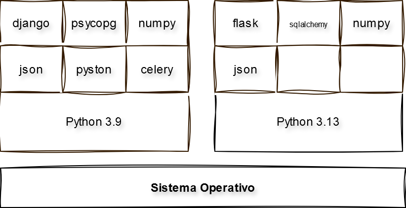
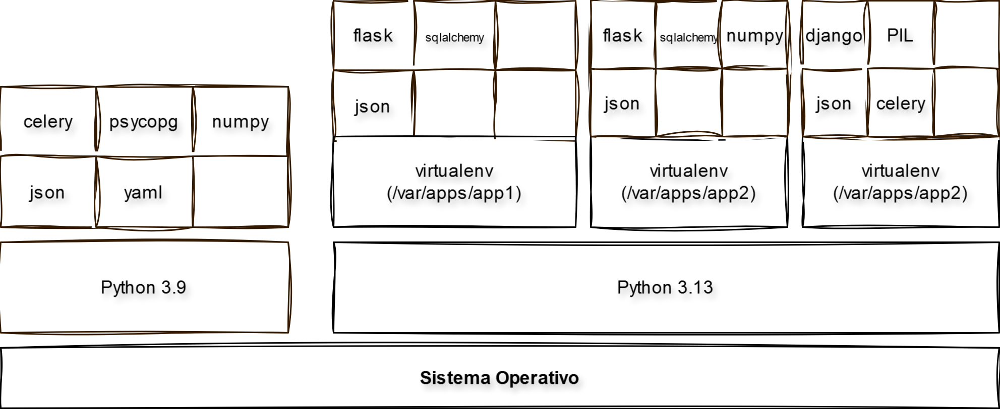

# Aplicaciones web con Python

## Entornos virtuales

### 2005 - Instituto Tecnológico de Mexicali

#### https://tinyurl.com/pyitm2025


---

# Instalando paquetes de terceros con `pip`

En el principio, no existe el modulo `flask`

```python
>>> import flask
Traceback (most recent call last):
  File "<python-input-0>", line 1, in <module>
    import flask
ModuleNotFoundError: No module named 'flask'
```

Ahora instalamos `flask`
  
```sh
pip install flask
```

```python
>>> import flask
```

---

# Desinstalando `flask`

```python
pip uninstall flask
Found existing installation: Flask 3.1.0
Uninstalling Flask-3.1.0:
  Would remove:
    c:\users\nniet\appdata\local\programs\python\python313\lib\site-packages\flask-3.1.0.dist-info\*
    c:\users\nniet\appdata\local\programs\python\python313\lib\site-packages\flask\*
    c:\users\nniet\appdata\local\programs\python\python313\scripts\flask.exe
Proceed (Y/n)? Y
  Successfully uninstalled Flask-3.1.0
```

---
# PYTHONPATH

- `PYTHONPATH` es una variable de entorno del sistema operativo que le dice al intérprete de Python dónde buscar módulos que se intentan importar con la instrucción `import`.
- Cuando se ejecuta `import mi_modulo`, Python busca `mi_modulo.py` (o un paquete `mi_modulo`) en varias ubicaciones, incluyendo las especificadas en `PYTHONPATH`.


---

# Usos del PYTHONPATH

Principalmente, `PYTHONPATH` se usa para:

*   **Importar módulos no instalados:** Permite importar módulos que no se han instalado con `pip install` y que se encuentran en directorios específicos del usuario o del proyecto. Esto es útil durante el desarrollo.

*   **Añadir rutas personalizadas:** Permite añadir rutas donde se encuentran módulos propios o de terceros que no están en las rutas estándar de Python.


---

## ¿Cómo funciona?

Cuando se ejecuta `import mi_modulo`, Python busca en el siguiente orden:

1.  El directorio actual.
2.  Las rutas especificadas en la variable de entorno `PYTHONPATH`.
3.  Los directorios de las bibliotecas estándar de Python.
4.  Los directorios de los paquetes de terceros instalados.


---


# El entorno de desarrollo de Python



---

# El entorno de desarrollo de Python




---

# Virtualenv

* Por default, `pip` instala paquetes en algún directorio de la instalación de Python. Por ejemplo: `/usr/lib/python3.12/site-packages`.
* Algunos paquetes de software pueden dañar la instalación de python.
* Linux y OSX dependen de Python.
* Instalar un paquete a nivel de sistema puede dejar inoperable otros programas.


---

# Package managers

- Manejo de versiones de paquetes y sus dependencias
- `pip` es el más usado
- Usaremos `uv`
  - Reemplaza `pip`, `pip-tools`, `pipx`, `poetry`, `pyenv`, `twine`, `virtualenv`, etc.
  - 10-100x más rápido que `pip`
  - Instala y administra versiones de Python
  - Corre e instala aplicaciones de Python
  - Se pueden definir scripts
  - https://docs.astral.sh/uv/


---

# Instalación de `uv`

https://docs.astral.sh/uv/#getting-started

<div class="columnas">
<div class="col">

## MacOS/Linux

```bash
curl -LsSf https://astral.sh/uv/install.sh | sh
```

</div>
<div class="col">

## Windows

```powershell
Set-ExecutionPolicy RemoteSigned -scope CurrentUser
powershell -c "irm https://astral.sh/uv/install.ps1 | iex"
```

</div>
</div>
---

# Siguiente: [Aplicacion web con Flask →](301-Flask.md)