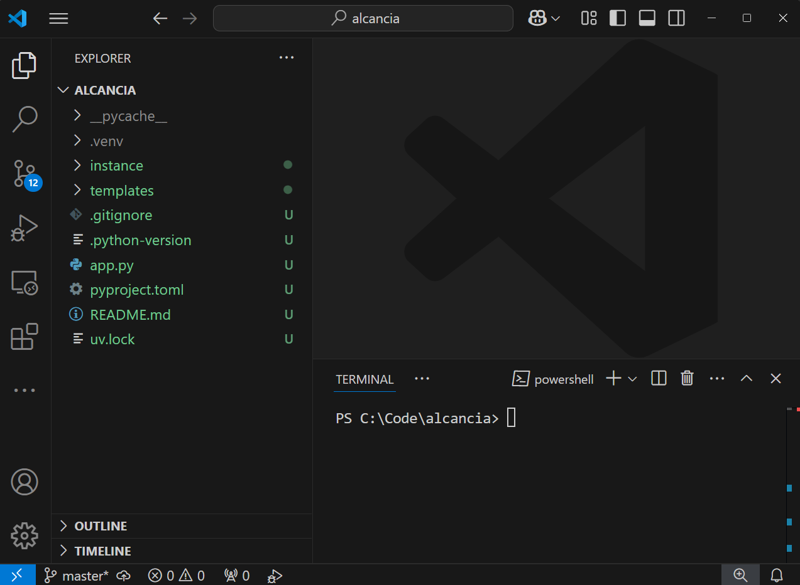

# Aplicaciones web con Python

## Aplicación web con Flask

### 2005 - Instituto Tecnológico de Mexicali

#### https://tinyurl.com/pyitm2025


---

<!--
paginate: true
header: Aplicaciones web con Python
footer: Instituto Tecnológico de Mexicali
-->


# Proyecto: Alcancía

- Alcancía es una aplicacion web que
  - Registra depósitos
  - Registra retiros
  - Despliega un balance del dinero que contiene


---

# Solucion: Aplicación web con Flask


- [Flask](https://flask.palletsprojects.com/en/stable/)
  - Servidor web
  - Plantillas html ([Jinja2](https://jinja.palletsprojects.com/en/stable/)).
    - [Bulma CSS](https://bulma.io/)
  - API JSON
  - Interfaz de línea de comandos
  - Base de datos:
    - [SQLite](https://sqlite.org/)
    - [SQLAlchemy](https://www.sqlalchemy.org/) ORM de Python
    - [Flask-SQLAlchemy](https://flask-sqlalchemy.readthedocs.io/en/stable/): Extensión que simplifica el uso de `SQLAlchemy` en apps de `Flask`.


---

# Herramientas de desarrollo

- VSCode con el plugin de Python
  - `ctrl`+`shift`+`P`
  - Extensions: Install extensions
  - `ms-python.python`
- UV, el administrador de proyectos en python (ver siguiente diapositiva)
- Descargar **DB Browser for SQLite** desde https://sqlitebrowser.org/


---

# Instalación de `uv`

https://docs.astral.sh/uv/#getting-started

<div class="columnas">
<div class="col">

## MacOS/Linux

```bash
curl -LsSf https://astral.sh/uv/install.sh | sh
```

</div>
<div class="col">

## Windows

```powershell
Set-ExecutionPolicy RemoteSigned -scope CurrentUser
powershell -c "irm https://astral.sh/uv/install.ps1 | iex"
```

</div>
</div>


---

# Creación del proyecto

- En una ventana de *PowerShell* creamos el proyecto inicial con `uv`
  ```
  uv init alcancia
  cd alcancia
  uv run .\hello.py
  ```
- Abrir la carpeta `alcancia` en **vscode**:
  > *Archivo* > *Abrir carpeta*.
- Abrir una terminal en **vscode**
- Ya podemos cerrar la ventana de *PowerShell*.



---

# Instalación de Flask

En la terminal de vscode:

```
uv add Flask
```


---

# Hola Mundo en flask

- Creamos `app.py` con el siguiente contenido
  ```python
  from flask import Flask

  app = Flask(__name__)

  @app.route("/")
  def hello_world():
      return "<p>Bienvenido a mi alcancia!</p>"
  ```
- Levantamos el servidor de Flask
  ```
  uv run flask run --debug
  ```
- Abrir http://127.0.0.1:5000

---

# Rutas

<div class="columnas">
<div class="col">

- `/` > Raiz de la aplicacion. Muestra el balance
- `/deposito` > Hacer un deposito
- `/retiro` > Hacer un retiro
- `/movimientos` > Histórico de movimientos

</div>
<div class="col">

```python
from flask import Flask

app = Flask(__name__)

@app.route("/")
def saldo():
    return "<p>Bienvenido a mi alcancia!</p><p>Tenemos <b>$0.00</b> pesos</p>"


@app.route("/deposito")
def deposito():
    return "<p>Aqui podras hacer un deposito</p>"


@app.route("/retiro")
def retiro():
    return "<p>Aqui podras hacer un retiro</p>"


@app.route("/movimientos")
def movimientos():
    return "<p>Lista de movimientos</p>"
```

</div>
</div>

Reiniciamos flask y probamos las rutas en el navegador.

---


# Plantillas

- Flask usa [Jinja2](https://jinja.palletsprojects.com/en/stable/)
  - Herencia de plantillas, macros, autoescape, cacheo, etc.
- Las plantillas se buscan en `templates` (relativo a `app.py`)

Layout de plantillas:

- `base.html` -> Estructura comun de las demas.
- `saldo.html`
- `deposito.html`
- `retiro.html`
- `movimientos.html`


---


# Plantilla base


- Flask no tiene un framework CSS, ni JS.
- Usaremos BulmaCSS. https://bulma.io/documentation/start/overview/#starter-template
- Copiar el starter template y guardarlo en `base.html`
- Modificar `base.html` para agregar los placeholders de:
  - Titulo
  - Contenido

---

# Plantilla de saldo

- Crear `saldo.html`
  - No olvidar mostrar el valor de la variable `saldo`.
- Modificar la ruta de saldo para usar la plantilla
  ```python
  from flask import render_template

  @app.route("/")
  def saldo():
      return render_template('saldo.html', saldo=0.0)

  ```


---

# Plantilla de deposito

- Crear `deposito.html`
- Modificar la ruta de saldo para usar la plantilla
  ```python
  from flask import render_template

  @app.route("/")
  def deposito():
      return render_template('deposito.html')

  ```

---

# Plantilla de retiro

- Crear `retiro.html`
- Modificar la ruta de saldo para usar la plantilla
  ```python
  from flask import render_template

  @app.route("/")
  def retiro():
      return render_template('retiro.html')

  ```

---

# Plantilla de movimientos

- Crear `movimientos.html`
- Modificar la ruta de saldo para usar la plantilla
  ```python
  from flask import render_template

  @app.route("/")
  def movimientos():
      return render_template('movimientos.html')

  ```

---

# Mensajes flash

Muy últiles para dar retroalimentación al usuario.

<div class="columnas">
<div class="col">

- Configuración en Python
  ```python
  from flask import flash


  app = Flask(__name__)
  app.secret_key = b'SVVMH3-lx0x1_jQ9LfBLWjo%qP'

  ```

</div>
<div class="col">

- Configuración en `base.html`
  ```html
        <div class="content">
          <div class="block">
            
              
                <div class="notificaciones">
                
                  <div class="notification {{ category }}">
                    <button class="delete"></button>
                    {{ message }}
                  </div>
                
                </div>
              
            
          </div>
          <div class="block">
            
          </div>
        </div>
  ```
</div>
</div>


---
# Formularios

- Especificar methods en `app.route()`: `POST` y `GET`.
- Flask define un objeto global llamado `request`.
- El tipo de petición esta disposible desde `request.method`
- Los datos del formulario estan en `request.form`.


---

# Primer formulario: `/deposito` - plantilla

<div class="columnas">
<div class="col">

- Mensajes flash
  ```html
    <form method="POST">
      
      <article class="message is-danger">
          <div class="message-body">
              Cantidad invalida
          </div>
      </article>
      
      <div class="field has-addons">
        ...
      </div>
    </form>
  ```


</div>
<div class="col">

- Formularios
  ```html
    <form method="POST">
      
      ...
      
      <div class="field has-addons">
          <div class="control">
              <input class="input is-large" 
              type="number"
              min="0" 
              step="0.01" 
              placeholder="$ 0.00" 
              name="cantidad">
          </div>
          <div class="control">
              <input type="submit" value="&#x1FA99; Depositar"
              class="button is-info is-large">
          </div>
      </div>
    </form>
  ```


</div>
</div>


---

# Primer formulario: `/deposito` - Python

<div class="columnas">
<div class="col">

```python
@app.route("/deposito")
def deposito():
    return render_template('deposito.html')
```

</div>
<div class="col">

```python
from flask import request, flash

@app.route("/deposito", methods=['POST', 'GET'])
def deposito():
    error = ''
    if request.method == 'POST':
        cantidad = request.form.get('cantidad', 0, type=int)
        if not cantidad:
            error = "Cantidad invalida"
        else:
            flash(f'Depositaste ${cantidad}')
    return render_template('deposito.html', error=error)

```

</div>
</div>

---

# Actividad

Hacer el formulario de retiro

---

## Listado de movimientos: plantilla

```html

  <table class="table is-bordered is-hoverable is-fullwidth">
    <thead>
      <tr>
        <td class="is-primary">Fecha</td>
        <td class="is-info">Cantidad</td>
      </tr>
    </thead>
    <tbody>
      
      <tr>
        <td>{{ m.fecha }}</td>
        <td>{{ "${:,.2f}".format(m.cantidad) }}</td>
      </tr>
      
    </tbody>
  </table>

```

---

## Listado de movimientos - Python

<div class="columnas">
<div class="col">

```python
from flask import render_template

@app.route("/")
def movimientos():
    return render_template('movimientos.html')

```

</div>
<div class="col">

```python
  from datetime import datetime

  @app.route("/movimientos")
  def movimientos():
      return render_template('movimientos.html', movimientos=[
          {'fecha': datetime(year=2025, month=1, day=1), 'cantidad': 10},
          {'fecha': datetime(year=2025, month=1, day=2), 'cantidad': 10},
          {'fecha': datetime(year=2025, month=1, day=3), 'cantidad': 10},
          {'fecha': datetime(year=2025, month=1, day=4), 'cantidad': 10},
          {'fecha': datetime(year=2025, month=1, day=5), 'cantidad': -30},
      ])
```
</div>
</div>

---

# Lo que tenemos hasta ahora

- Aplicación básica con 4 rutas
  1. Plantilla base configurada
  1. Reporte de saldo
  1. Dos formularios: depósitos y retiros
  1. Reporte de movimientos

## Siguiente paso

- Persistencia de datos

---
# Click


> Click is a Python package for creating beautiful command line interfaces in a composable way with as little code as necessary. It’s the “***Command Line Interface Creation Kit***”. It’s highly configurable but comes with sensible defaults out of the box.

**Flask** usa `click` internamente para implementar su línea de comandos. Y nosotros podemos agregar subcomandos al comando `flask`


---

# SQLAlchemy

<div class="columnas">
<div class="col">


</div>
<div class="col">

- ORM para Python
- Dialectos soportados: **SQLite**, Postgresql, MySQL/MariaDB, Oracle, MS SQLServer. +30 dialectos soportados mediante librerías externas.
- **Flask-SQLAlchemy**: integración de Flask con modelos de SQLAlchemy
</div>
</div>

### Instalación

```sh
uv add Flask-SQLAlchemy
```

---

# Configurar ORM

<div class="columnas">
<div class="col">

- Importar `SQLAlchemy` y `click`
- Definir URI de la base de datos
- Escribir clase para `Movimiento`
- Escribir script para inicializar la bd

</div>
<div class="col">

```python
from flask_sqlalchemy import SQLAlchemy
from sqlalchemy.sql import func
import click

app.config["SQLALCHEMY_DATABASE_URI"] = "sqlite:///alcancia.db"
db = SQLAlchemy(app)


class Movimiento(db.Model):
    id = db.Column(db.Integer, primary_key=True)
    fecha = db.Column(db.DateTime, server_default=func.now())
    cantidad = db.Column(db.Numeric)


@app.cli.command()
def initdb():
    """
    Inicializa la base de datos de la alcancia
    """
    click.echo('Inicializando la base de datos')
    db.create_all()
```

</div>
</div>

---

# El comando initdb

- Primero verificar que el comando ya esta disponible

```
uv run flask
[...]
Commands:
  initdb  Inicializa la base de datos de la alcancia
  routes  Show the routes for the app.
  run     Run a development server.
  shell   Run a shell in the app context.
```

- Crea la base de datos en `instance/alcancia.db`
- Abrir la base de datos en **DB Browser (SQLite)** y confirmar que se ha creado la estructura de la BD.

---

# Persistir datos en la BD: depósitos

```python
depo = Movimiento(cantidad=cantidad)
db.session.add(depo)
db.session.commit()
```


---


# Actividad

Implementar la ruta de retiros

---

# Reporte de saldo


- En `app.py`
  ```python
  from sqlalchemy.sql import func

  @app.route("/")
  def saldo():
      return render_template(
          'saldo.html',
          saldo=db.session.scalar(func.sum(Movimiento.cantidad))
      )
  ```
- En `templates/saldo.html`
```html

  <h2>El saldo es <b> {{"$%.2f"|format(saldo)}} </b></h2>

```

---

# Reporte de movimientos

En `app.py`

```python
@app.route("/movimientos")
def movimientos():
    q = db.session.execute(db.select(Movimiento).order_by(Movimiento.fecha))
    return render_template('movimientos.html', movimientos=q.scalars())
```

---

# Reporte de movimientos


En `templates/saldo.html`

```html

  <table class="table is-bordered is-hoverable is-fullwidth">
    <thead>
      <tr>
        <td class="is-primary">Fecha</td>
        <td class="is-info">Cantidad</td>
      </tr>
    </thead>
    <tbody>
      
      <tr>
        <td>{{ m.fecha }}</td>
        <td>{{ "${:,.2f}".format(m.cantidad) }}</td>
      </tr>
      
    </tbody>
  </table>

```

</div>
</div>

---


# Siguiente: [Agregando un API Rest →](302-REST.md)